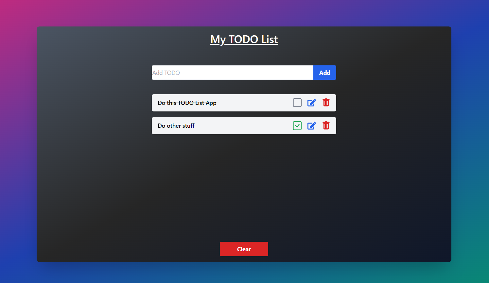

# TODO List Application



This is a simple TODO list application built using React, Redux Toolkit, Tailwind CSS, and local storage for data persistence.

## Features

- Add new TODO items
- Update existing TODO items
- Mark TODO items as done/undone
- Delete TODO items
- Toggle input form for adding/updating TODO items
- Data persistence using local storage

## Technologies Used

- React
- Redux Toolkit
- Tailwind CSS
- React Icons
- React Redux
- Local Storage

## Usage

Clone the repository:

   ```shell
   git clone https://github.com/klisiubb/iwai.git
   ```
Install dependencies:
```shell
cd todo
npm install
```
Start the development server:
```shell
npm run dev
```
